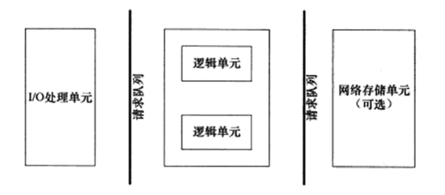
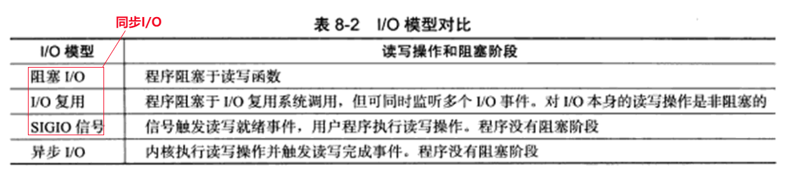
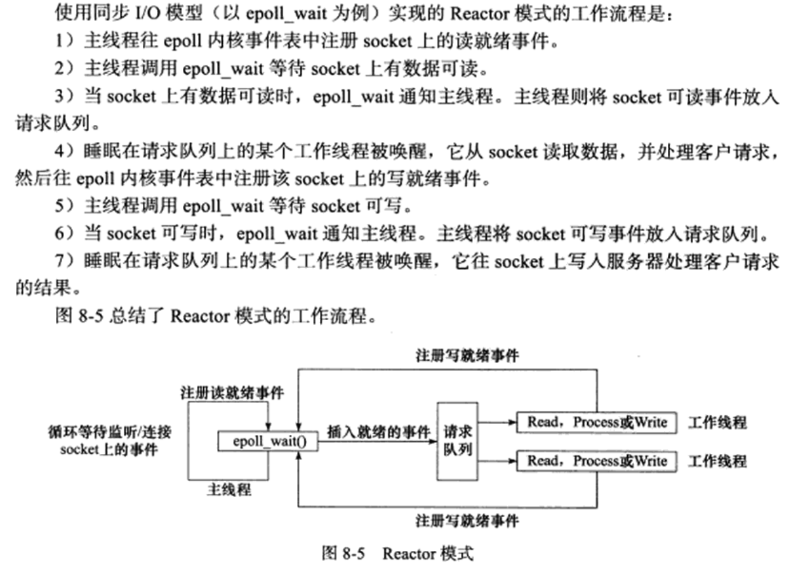
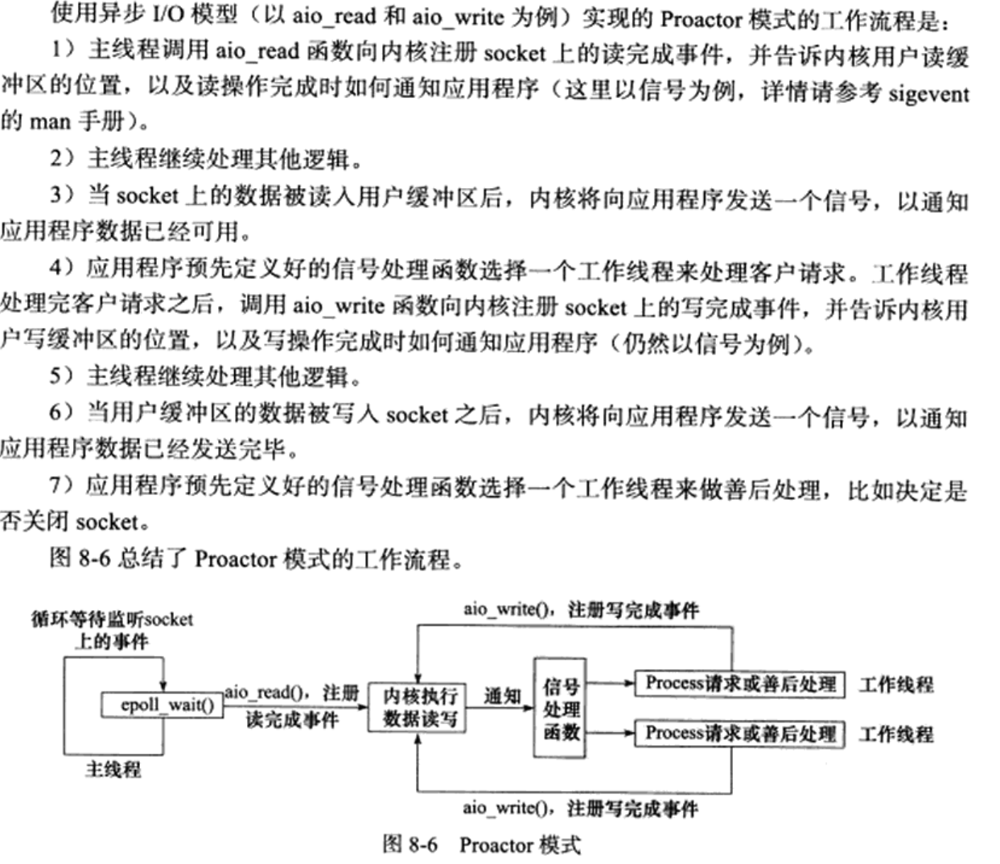
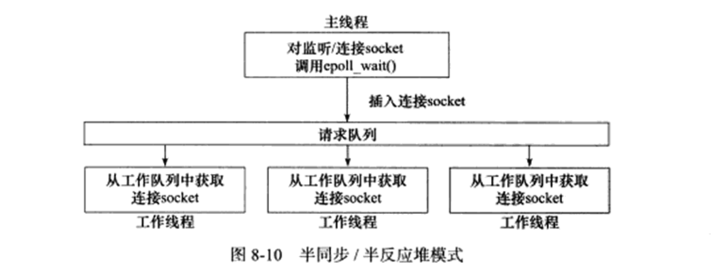

# Nano Web Server

TODO: kuiperInfer 集成，实现上传图片返回分割结果

## 基础知识

### 服务器框架


服务器基本框架：I/O 单元 + 逻辑单元 + 网络存储单元 （各个单元间通信方式：请求队列）

### 四种 I/O 模型


基础概念：

1. 同步 I/O：用户代码自行执行 I/O 操作（数据从内核缓冲区读入用户缓冲区或从用户缓冲区写入内核缓冲区），**同步 I/O 内核向应用程序通知的是就绪事件**
2. 异步 I/O: 数据在内核缓冲区和用户缓冲区之间的移动是由内核在“后台”完成的，**异步 I/O 内核向应用程序通知的是完成事件**
3. 阻塞 I/O：阻塞的文件描述符，针对阻塞 I/O 执行的系统调用可能因为无法立即完成而被操作系统挂起，直到等待的事件发生为止
4. 非阻塞 I/O：非阻塞的文件描述符，针对非阻塞 I/O 执行的系统调用总是立即返回，而不管事件是否已经发生

### 两种事件处理模式

服务器程序通常需要处理三类事件： I/O 事件、信号及定时事件

1. **reactor 模式**：主线程(I/O处理单元)只负责监听文件描述符上是否有事件发生，有的话立即通知工作线程(逻辑单元)，读写数据、接受新连接及处理客户请求均在工作线程中完成。通常由**同步 I/O**实现。


2. **proactor模式**：主线程和内核负责处理读写数据、接受新连接等I/O操作，工作线程仅负责业务逻辑，如处理客户请求。通常由**异步 I/O**实现。


### 两种并发模式

1. 半同步/半异步模式
   1. 并发模式中的同步和异步：同步指的是程序完全按照代码序列的顺序执行，异步指的是程序的执行需要由系统事件驱动
   2. I/O 模型中的同步和异步区分的是内核向应用程序通知的是何种 I/O 事件（就绪事件 or 完成事件），以及由谁完成 I/O 读写（应用程序 or 内核）
   3. 半同步/半异步模式中，同步线程用于处理客户逻辑，异步线程用于处理 I/O 事件
   4. 服务器程序中，综合考虑两种事件处理模式和几种 I/O 模型，则半同步/半异步模式存在多种变体。其中有一种变体称为半同步/半反应堆模式：异步线程只有一个，由主线程充当。同步线程（工作线程）处理客户逻辑。工作模式是 Reactor 模式
   
2. 领导者/追随者模式

## 项目特性

1. 利用 epoll 与线程池实现 Reactor 高并发模型
2. 利用状态机与正则实现 HTTP 请求报文解析和 HTTP 响应生成，可处理 GET 和 POST 请求
3. 用 vector 容器封装 char,实现一个可自动扩容的缓冲区
4. 基于 epoll_wait 实现定时功能，关闭超时的非活动连接，并用小根堆作为容器管理定时器
5. 利用单例模式实现了一个简单的线程池，减少了线程创建与销毁的开销
6. 利用单例模式实现 MySQL 数据库连接池，减少数据库连接建立与关闭的开销，实现了用户注册登录功能
7. 利用单例模式与阻塞队列实现异步日志系统，记录服务器运行状态
8. 能够处理前端发送的`multi/form-data`类型的 POST 请求，实现了文件上传功能
9. 通过 jsoncpp 生成 json 数据，向前端发送文件列表，实现文件展示与下载

## Workflow

1. git push

   ```bash
   # 添加子模块
   git submodule add https://github.com/open-source-parsers/jsoncpp.git jsoncpp
   
   git add .
   git commit -m "message"
   git push origin main
   ```

2. git clone & install

   ```bash
   git clone https://github.com/kyrie2to11/NanoServer.git
   git submodule update --init --recursive
   cd jsoncpp
   cmake -S . -B build
   cd build && make
   sudo make install
   ```

   ```bash
   vim ~/.bashrc
   # jsoncpp
   export LD_LIBRARY_PATH=$LD_LIBRARY_PATH:/usr/local/lib
   ```

3. mysql config

   ```bash
   # 报错：ERROR 2002 (HY000): Can't connect to local MySQL server through socket '/var/run/mysqld/mysqld.sock' (2)
   # mysql 服务重启
   service mysql restart 
   ```

   ```sql
   -- 创建数据库
   create database webdb;

   -- 创建user表
   USE webdb;
   CREATE TABLE user(
      username char(50) NULL,
      passwd char(50) NULL
   )ENGINE=InnoDB;

   -- 添加数据
   INSERT INTO user(username, passwd) VALUES('username', 'password');

   -- webdb是数据库名，user是表名，需要在main函数中传入
   ```

4. start server

   ```bash
   tmux
   cd NanoServer
   ./bin/server

   ctrl + b + d # detach session
   tmux attach-session -t 0 # attach session
   
   # 默认访问端口： 1316 可在 main.cpp 更改
   ```

## 致谢

1. Linux高性能服务器编程，游双著
2. [markparticle/WebServer](https://github.com/markparticle/WebServer)
3. [Sakura1221/SimpleWebServer](https://github.com/Sakura1221/SimpleWebServer.git)
4. [wustghj/SimpleServer](https://github.com/wustghj/SimpleServer.git)